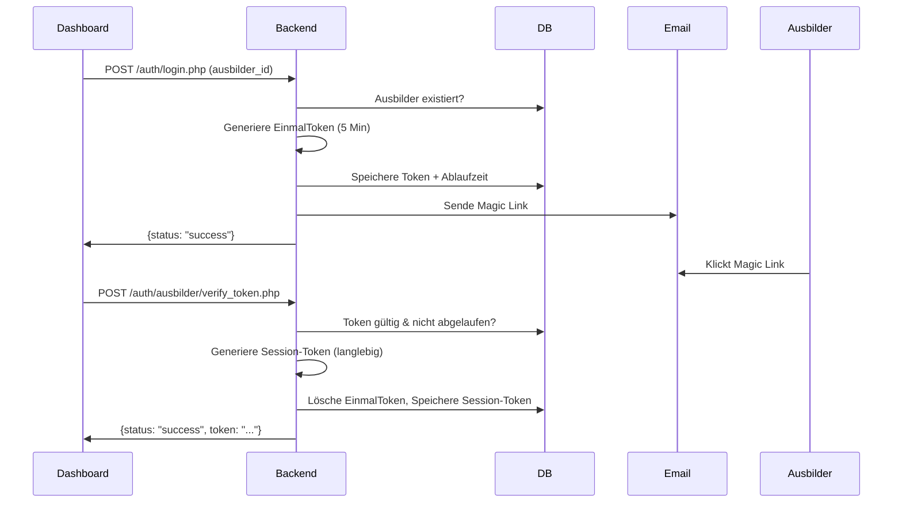
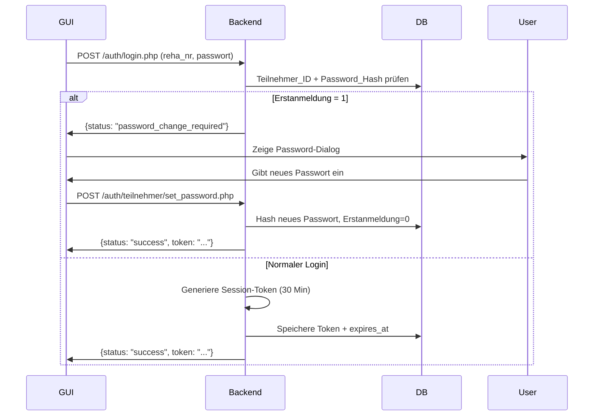

# BAT-Man Authentication Backend (BAT-Man-AT)

Zentrales Backend-System für die Authentifizierung von Ausbildern und Teilnehmern im BAT-Man-Projekt.

---

## 📋 Projektübersicht

**BAT-Man-AT** ist das PHP-basierte Authentication-Backend für das BAT-Man-Gesamtsystem. Es bietet zwei separate Authentifizierungsmethoden:

- **Ausbilder:** Passwortloses Login via Magic Link (Email)
- **Teilnehmer:** Passwortbasiertes Login mit Session-Tokens

Alle Endpoints liefern JSON-Responses und nutzen POST-Requests für maximale Sicherheit.

---

## 🏗️ Projektstruktur

```
BAT-Man-AT/
├── auth/                              # Hauptverzeichnis für Authentifizierung
│   ├── login.php                      # Zentraler Einstiegspunkt
│   ├── ausbilder/                     # Ausbilder-spezifische Logik
│   │   ├── authenticate.php           # Magic Link generieren
│   │   ├── verify_token.php           # Magic Link verifizieren
│   │   └── send_mail.php              # Email-Versand (PHPMailer/SMTP)
│   └── teilnehmer/                    # Teilnehmer-spezifische Logik
│       ├── authenticate.php           # Login mit Passwort
│       ├── set_password.php           # Erstanmeldung: Passwort setzen
│       ├── change_password.php        # Passwort ändern
│       ├── validate_token.php         # Session-Token validieren
│       └── logout.php                 # Logout
├── config/                            # Konfigurationsdateien
│   └── setup_passwords.php            # Password-Hash Generator (Hilfstool)
├── restore/                           # Backup alter Dateien
└── README.md                          # Diese Datei
```

---

## � Authentifizierungsflows

### Ausbilder (Magic Link)



**Eigenschaften:**
- ✅ Keine Passwörter nötig
- ✅ EinmalToken: 5 Minuten gültig, Single-Use
- ✅ Session-Token: Langlebig, kein Ablauf
- ✅ Personalisierte Email-Anrede (Herr/Frau)

---

### Teilnehmer (Passwort + Session)



**Eigenschaften:**
- ✅ Passwort-Hashing (Bcrypt)
- ✅ Session-Token: 30 Minuten gültig
- ✅ Erstanmeldung: Erzwingt Passwort-Änderung
- ✅ Logout-Funktion

---

## 📡 API Endpoints

### Zentral

#### Login (Ausbilder & Teilnehmer)
```http
POST /auth/login.php

# Ausbilder:
Body: login_type=Ausbilder, ausbilder_id=2

# Teilnehmer:
Body: login_type=Teilnehmer, reha_nr=90104, passwort=xyz
```

---

### Ausbilder

#### Token verifizieren
```http
POST /auth/ausbilder/verify_token.php
Body: token=abc123...

Response:
{
  "status": "success",
  "role": "Ausbilder",
  "user_id": 2,
  "name": "Mustermann Max",
  "token": "session-token-64-zeichen"
}
```

---

### Teilnehmer

#### Passwort setzen (Erstanmeldung)
```http
POST /auth/teilnehmer/set_password.php
Body: user_id=90104, new_password=MeinPasswort123!

Response:
{
  "status": "success",
  "token": "...",
  "expires_at": "2025-12-01 12:00:00"
}
```

#### Passwort ändern (eingeloggt)
```http
POST /auth/teilnehmer/change_password.php
Body: reha_nr=90104, neues_passwort=NeuesPasswort123!

Response:
{
  "status": "success",
  "message": "Passwort erfolgreich geändert"
}
```

#### Token validieren
```http
POST /auth/teilnehmer/validate_token.php
Body: token=abc123...

Response:
{
  "status": "success",
  "user_id": 90104
}
```

#### Logout
```http
POST /auth/teilnehmer/logout.php
Body: token=abc123...

Response:
{
  "status": "success"
}
```

---

## ⚙️ Installation & Deployment

### Voraussetzungen

- **PHP:** 7.4 oder höher
- **MySQL/MariaDB:** 5.7 oder höher
- **PHPMailer:** Für Email-Versand (via Composer)
- **Apache/Nginx:** Webserver

### Deployment auf Server

1. **Dateien hochladen:**
   ```bash
   # Auf Server (z.B. /var/www/html/it202407/)
   scp -r BAT-Man-AT/* user@server:/var/www/html/it202407/
   ```

2. **PHPMailer installieren:**
   ```bash
   cd /var/www/html/it202407/auth/ausbilder
   composer require phpmailer/phpmailer
   ```

3. **Konfiguration anpassen:**
   - `send_mail.php`: SMTP-Credentials & Dashboard-URL
   - Alle `*.php`: Datenbankverbindung (Host, DB-Name, User, Passwort)

4. **Berechtigungen setzen:**
   ```bash
   chmod 755 /var/www/html/it202407/auth
   chmod 644 /var/www/html/it202407/auth/*.php
   ```

---

## �️ Datenbank-Schema

### Ausbilder-Tabelle

| Spalte | Typ | Beschreibung |
|--------|-----|--------------|
| Ausbilder_ID | INT | Primary Key |
| Nachname | VARCHAR | Nachname |
| Vorname | VARCHAR | Vorname |
| EMail | VARCHAR(255) | Email-Adresse für Magic Link |
| Geschlecht | VARCHAR(10) | "Herr" oder "Frau" (für Email-Anrede) |
| EinmalToken | VARCHAR(255) | Magic Link Token (5 Min gültig) |
| Token_Expired | DATETIME | Ablaufzeit des EinmalTokens |
| Token | VARCHAR(255) | Session-Token (langlebig) |

### Teilnehmer-Tabelle

| Spalte | Typ | Beschreibung |
|--------|-----|--------------|
| Teilnehmer_ID | INT | Primary Key (= Reha-Nr) |
| Password_Hash | VARCHAR(255) | Bcrypt-Hash des Passworts |
| Erstanmeldung | BOOLEAN | 1 = Passwort-Änderung erforderlich |
| Token | VARCHAR(255) | Session-Token (30 Min) |
| Token_Expired | DATETIME | Ablaufzeit des Session-Tokens |

---

## 🔒 Sicherheitsfeatures

✅ **Bcrypt Password Hashing** - `password_hash()` mit `PASSWORD_DEFAULT`  
✅ **Prepared Statements** - Schutz gegen SQL-Injection  
✅ **POST-Only Endpoints** - Tokens nicht in Server-Logs  
✅ **Token-Ablaufzeiten** - EinmalToken: 5 Min, Session: 30 Min  
✅ **Single-Use Tokens** - EinmalToken wird nach Verwendung gelöscht  
✅ **SMTP mit TLS** - Verschlüsselter Email-Versand  

---

## 🧪 Testing

### Lokales Testen (PHP Built-in Server)

```bash
cd BAT-Man-AT
php -S localhost:8000
```

### Test mit PowerShell

**Teilnehmer-Login:**
```powershell
Invoke-WebRequest -Uri "http://***.***.***.***/it202407/auth/login.php" -Method POST -Body @{
    login_type="Teilnehmer"; 
    reha_nr="90104"; 
    passwort="test"
}
```

**Ausbilder-Login:**
```powershell
Invoke-WebRequest -Uri "http://***.***.***.***/it202407/auth/login.php" -Method POST -Body @{
    login_type="Ausbilder"; 
    ausbilder_id="2"
}
```

---

## 🛠️ Konfiguration

### SMTP-Einstellungen (send_mail.php)

```php
$mail->Host       = 'smtp.DIENSTLEISTER.de';
$mail->Username   = 'dein-username';
$mail->Password   = 'dein-passwort';
$mail->SMTPSecure = PHPMailer::ENCRYPTION_STARTTLS;
$mail->Port       = 587;
```


### Datenbankverbindung (alle PHP-Dateien)

```php
$db_host = "***.***.***.***";
$db_name = "it202407";
$db_user = "******";
$db_password = "******";
```

---

## 📝 Hilfswerkzeuge

### Password-Hash Generator

```bash
php config/setup_passwords.php
```

Generiert Bcrypt-Hashes für manuelle Passwort-Erstellung in der Datenbank.

---

## 🔄 Versionsverwaltung

**Aktuelle Version:** 1.0  
**Letzte Änderung:** 02.12.2025

### Changelog

- **v1.0** (02.12.2025)
  - ✅ Ausbilder Magic Link Authentifizierung
  - ✅ Teilnehmer Passwort-Login mit Session-Tokens
  - ✅ Erstanmeldung-Flow (Passwort setzen)
  - ✅ Passwort-Änderung für eingeloggte User
  - ✅ PHPMailer SMTP-Integration
  - ✅ Organisierte Ordnerstruktur (ausbilder/ & teilnehmer/)

---

## 👥 Team

**Projekt:** BAT-Man Authentication Backend  
**Team:** AT-Team (Authentication)  
**Technologie-Stack:** PHP, MySQL, PHPMailer  

---

## � Lizenz

Internes BfW-Projekt - Alle Rechte vorbehalten